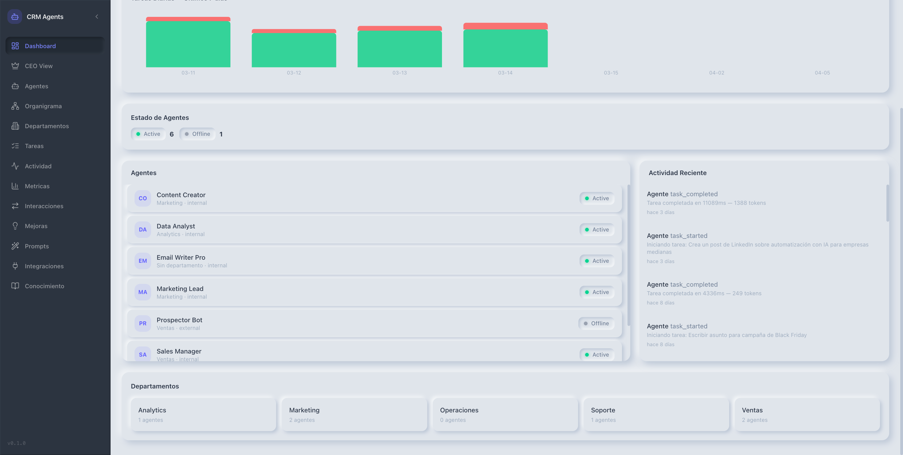
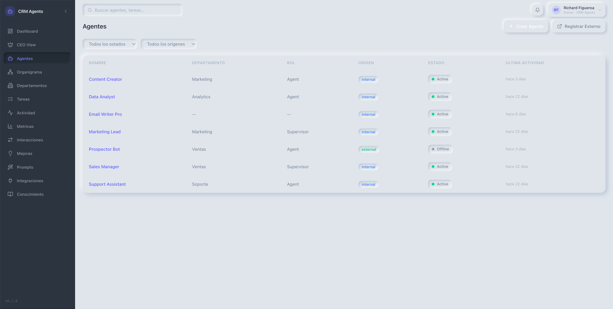
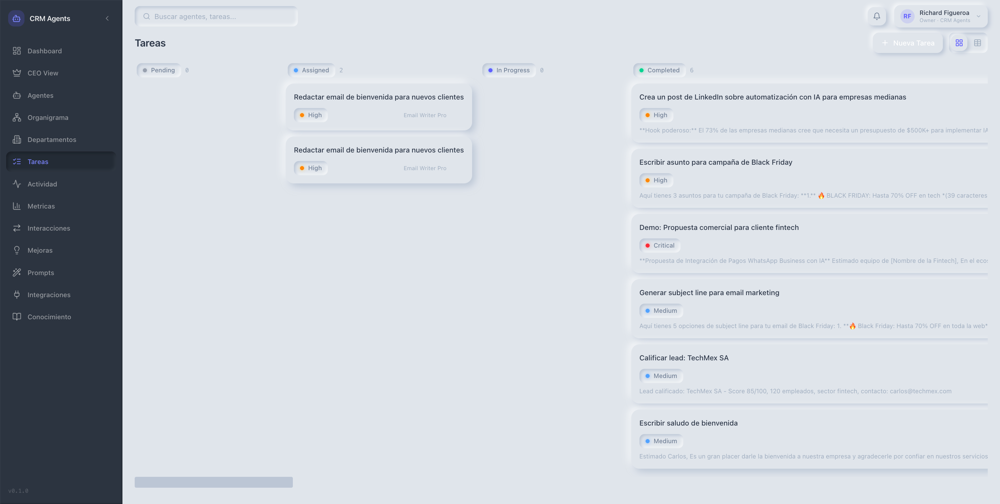
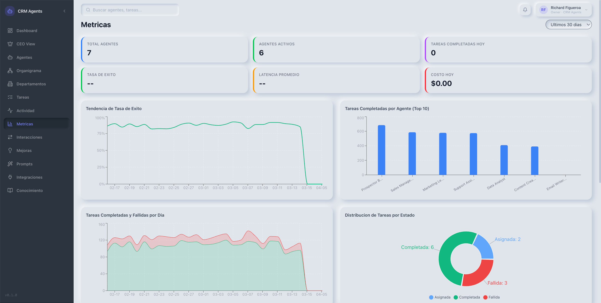
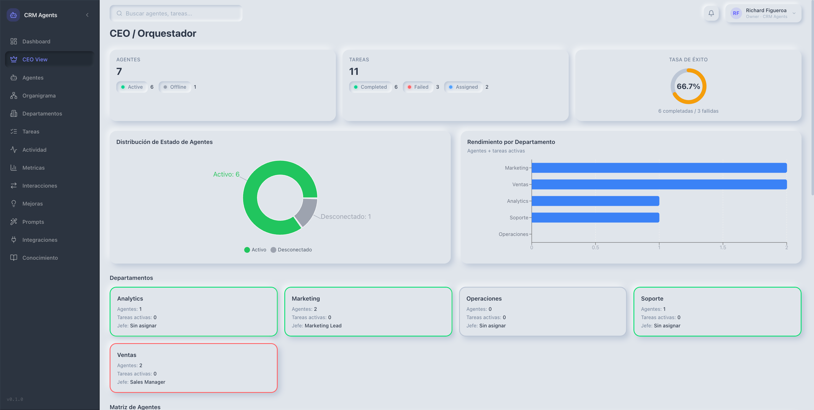

<div align="center">

# 🤖 CRM Agents

**A platform where companies manage AI agents like employees — with departments, tasks, performance metrics, and a knowledge base.**

[](https://python.org)
[](https://fastapi.tiangolo.com)
[](https://react.dev)
[](https://typescriptlang.org)
[](https://postgresql.org)
[](https://tailwindcss.com)

🟡 **Active development** — MVP functional, core features complete, advanced agent orchestration in progress.

</div>

---

## Demo

> Screenshots taken from a live local instance with seeded demo data (7 agents, 5 departments, 30 days of metrics).

### Dashboard — Live activity feed + agent fleet status


### Agents — Full team roster with status, department, and origin


### Tasks — Kanban board with real AI-generated outputs


### Metrics — 30-day performance trends across all agents


### CEO Dashboard — Org-wide KPIs and department health


---

## The Problem

Companies deploying AI agents across multiple platforms face the same core challenge: **visibility and control at scale**.

You have a Claude agent generating content, an n8n workflow handling lead qualification, a LangChain chain processing documents — each living in a different tool, with no shared way to track performance, manage failures, or understand what they're actually doing day to day.

CRM Agents solves this by treating AI agents the way a company treats its employees — with departments, supervisors, task assignments, performance reviews, and an HR system that actually knows who's doing what.

---

## What This Platform Does

**Organizational Management**
Structure your AI agents into departments with supervisor/subordinate relationships. Visualize the full org chart, assign agents to roles, and track their status in real time. Agents can be internal (Claude API) or external (any platform: n8n, LangChain, CrewAI, custom webhooks).

**Task Execution & Delegation**
Assign tasks to any agent and execute them live. Internal agents call the Claude API and stream results back. External agents receive a dispatch webhook and report results via callback. Every execution is logged — inputs, outputs, tokens, cost, latency.

**Performance Intelligence**
Background workers calculate per-agent KPIs hourly: tasks completed, success rate, average response time, token usage, and cost in USD. 30 days of historical data with daily, weekly, and monthly rollups. Leaderboards, trend charts, and cost analysis across the entire fleet.

**RAG Knowledge Base**
A two-level knowledge base (org-wide + per-department) powered by PostgreSQL full-text search. Upload documents that agents automatically retrieve and inject into their context when executing tasks — no external vector database required.

**Real-Time Event Stream**
A Server-Sent Events bus broadcasts every task lifecycle event and agent status change to all connected dashboards instantly. No polling.

**Prompt Engineering**
Full version control for every agent's system prompt. Compare versions side by side, track performance per version, and apply reusable prompt templates across multiple agents.

**CEO & Operator Dashboards**
Two dashboards with different lenses on the same data. The operator dashboard shows live task activity, agent status, and an activity log. The CEO dashboard shows org-wide KPIs, top-agent leaderboard, supervisor trees, and automated alerts for stale agents, failed tasks, and error patterns.

**External Integration Management**
Register and monitor any external platform your agents live on. Health checker runs every 5 minutes and marks agents as ERROR if their endpoint goes offline, triggering an SSE alert immediately.

---

## Architecture

```
┌──────────────────────────────────────────────────────────┐
│                  React 19 Frontend                        │
│                                                          │
│  18 pages · Recharts · react-d3-tree · TanStack Table   │
│  React Query · Zustand · React Hook Form + Zod          │
│  Server-Sent Events (real-time updates)                  │
└──────────────────────┬───────────────────────────────────┘
                       │  HTTP + SSE  (/api/v1)
┌──────────────────────▼───────────────────────────────────┐
│               FastAPI Backend (Python 3.13)               │
│                                                          │
│  12 routers · 60+ endpoints · JWT auth                  │
│  SQLAlchemy async ORM · Alembic migrations              │
│                                                          │
│  Background Workers (asyncio, in-process):              │
│    ├── Metrics Calculator      → runs every 1 hour      │
│    ├── Heartbeat Monitor       → runs every 60 seconds  │
│    └── Integration Health Checker → runs every 5 min    │
│                                                          │
│  External Integrations:                                  │
│    ├── Claude API (internal agent execution)  │
│    ├── n8n webhook dispatch + result callbacks          │
│    ├── LangChain / CrewAI adapter pattern              │
│    └── Generic webhook adapter (custom platforms)       │
└──────────────────────┬───────────────────────────────────┘
                       │  asyncpg
┌──────────────────────▼───────────────────────────────────┐
│              PostgreSQL 16                                │
│                                                          │
│  18 tables · JSONB metadata · UUID PKs                  │
│  Multi-tenant via organization_id                       │
│  Full-text search (tsvector/GIN) for RAG                │
└──────────────────────────────────────────────────────────┘
```

---

## Key Design Decisions

**Why in-process workers instead of Celery/Redis?**
For a CRM at this scale, `asyncio.create_task()` inside the FastAPI lifespan is simpler, has no infrastructure dependencies, and is easier to reason about. The worker architecture is explicitly designed so that moving to Redis + Celery requires no API changes — just swapping the task runner.

**Why PostgreSQL full-text search for RAG instead of a vector database?**
Pinecone, Weaviate, and pgvector all require additional setup, cost, or operational overhead. `tsvector`/`tsquery` with a GIN index covers the retrieval quality needed for structured business documents (policies, pricing, procedures) and keeps the stack to a single database.

**Why SSE instead of WebSockets?**
Dashboard updates are strictly server → client. SSE is simpler to implement, works through proxies without configuration, and requires no handshake management.

**Why multi-tenant from day one?**
Every table carries `organization_id`. All queries are scoped at the repository layer. Retrofitting multi-tenancy is expensive and error-prone — this was a deliberate decision made at the data model design phase.

**Why agent duality (internal vs external)?**
Real enterprise deployments don't run everything on one platform. The duality pattern lets a single CRM manage both Claude-powered agents and existing n8n/LangChain workflows under the same organizational structure, metrics system, and dashboard — without forcing a platform migration.

---

## Tech Stack

| Layer | Technology | Purpose |
|---|---|---|
| **Frontend** | React 19 + TypeScript | UI framework |
| **Build** | Vite 6 | Dev server + production bundler |
| **Styling** | Tailwind CSS 4 | Utility-first CSS |
| **State** | Zustand + TanStack React Query | Local state + server cache |
| **Routing** | React Router 7 | Client-side navigation |
| **Forms** | React Hook Form + Zod | Form validation |
| **Tables** | TanStack Table 8 | Sortable/filterable data tables |
| **Charts** | Recharts 2 | Time series, bar, area charts |
| **Tree viz** | react-d3-tree | Org chart + interaction graph |
| **Backend** | FastAPI 0.115 + Python 3.13 | REST API + SSE |
| **ORM** | SQLAlchemy 2 (async) | Database abstraction |
| **Migrations** | Alembic | Schema versioning |
| **Database** | PostgreSQL 16 | Primary data store + full-text search |
| **Auth** | JWT (python-jose) + bcrypt | Authentication |
| **LLM** | Claude API | Internal agent execution |
| **HTTP client** | httpx | Async external API calls |

---

## Project Structure

```
crm-agents/
├── backend/
│   ├── app/
│   │   ├── agents/          # Agent CRUD, roles, heartbeat
│   │   ├── auth/            # JWT login, refresh, user context
│   │   ├── core/            # Database, config, events bus, middleware
│   │   ├── departments/     # Department hierarchy
│   │   ├── events/          # SSE stream router
│   │   ├── improvements/    # Improvement tracking workflow
│   │   ├── integrations/    # Webhook handlers, platform adapters
│   │   ├── interactions/    # Agent-to-agent communication log
│   │   ├── knowledge/       # RAG knowledge base (docs + chunks + search)
│   │   ├── metrics/         # KPI aggregation + leaderboard
│   │   ├── prompts/         # Prompt versions + template library
│   │   ├── tasks/           # Task management + execution engine
│   │   └── workers/
│   │       ├── agent_executor.py
│   │       ├── metrics_calculator.py
│   │       ├── heartbeat_monitor.py
│   │       └── integration_health_checker.py
│   ├── alembic/             # Database migrations
│   ├── seed.py              # Demo data (agents, departments, roles)
│   ├── seed_metrics.py      # 30 days of historical metrics
│   └── pyproject.toml
│
└── frontend/
    └── src/
        ├── api/             # Axios client + typed API functions
        ├── components/
        │   ├── charts/      # Sparkline, BarChart, AreaChart, DonutChart
        │   ├── common/      # StatusBadge, LoadingSpinner, ErrorBoundary
        │   └── layout/      # AppShell, Sidebar, Header
        ├── features/
        │   ├── agents/      # Agent list, detail, create, register
        │   ├── dashboard/   # Main dashboard + CEO dashboard
        │   ├── departments/ # Department list + detail
        │   ├── integrations/
        │   ├── knowledge/   # RAG document upload, search, management
        │   ├── metrics/
        │   ├── prompts/     # Prompt engineering UI
        │   └── tasks/
        ├── hooks/           # useEventStream (SSE), useDebounce
        ├── store/           # Zustand auth store
        └── types/           # TypeScript interfaces
```

---

## Quick Start

```bash
# Backend
cd backend
pip install -e .
alembic upgrade head
python seed.py && python seed_metrics.py
uvicorn app.main:app --reload

# Frontend (separate terminal)
cd frontend
npm install
npm run dev
```

Requires PostgreSQL 16 running locally. Set `DATABASE_URL` and `ANTHROPIC_API_KEY` in `.env`.

Interactive API docs at **http://localhost:8000/docs** once backend is running.

---

## Data Model Highlights

- **Multi-tenancy** — Every table carries `organization_id`. All queries are scoped automatically at the repository layer.
- **Agent duality** — An `Agent` can be `internal` (backed by an LLM, has an `AgentDefinition`) or `external` (backed by a webhook/API, has an `AgentIntegration`).
- **Flexible metadata** — `JSONB` columns on activities, tasks, and integrations store payload details without schema migrations.
- **Self-referential hierarchy** — Agents have a nullable `supervisor_id`. Departments have a nullable `parent_id`. Tasks have a nullable `parent_id` (subtasks).
- **Metric periods** — `PerformanceMetric` records per period: `daily`, `weekly`, `monthly`. Weekly/monthly rollups aggregate from daily.
- **2-level RAG scope** — `KnowledgeDocument.department_id IS NULL` = org-wide. `department_id SET` = department-only.

---

## API Overview

The REST API is versioned under `/api/v1`. All endpoints except auth require a JWT Bearer token.

| Module | Prefix | Key operations |
|---|---|---|
| Auth | `/auth` | Login, token refresh, current user |
| Agents | `/agents` | CRUD, roles, heartbeat, subordinates |
| Departments | `/departments` | CRUD, tree view, agent assignment |
| Tasks | `/tasks` | CRUD, assign, execute, subtasks |
| Metrics | `/metrics` | Overview, summary, leaderboard, trend, recalculate |
| Activities | `/activities` | List, summary |
| Interactions | `/interactions` | List, graph |
| Improvements | `/improvements` | CRUD, status workflow |
| Prompts | `/prompts` | Templates CRUD, version history per agent |
| Integrations | `/integrations` | Webhook receiver, dispatch, health check |
| Knowledge | `/knowledge` | Ingest documents, full-text search, manage scope |
| Events | `/events` | SSE stream, subscriber count |

---

## Use Cases

**AI Consulting / Agency Operations** — Manage client-facing AI agents across departments. Each department gets its own knowledge base with brand guidelines, pricing, and case studies that agents automatically pull from.

**Enterprise AI Fleet Management** — Register existing AI automations (n8n workflows, LangChain chains, custom scripts) as external agents. Get unified performance metrics and alerts across platforms.

**Content Production at Scale** — Set up a marketing department with specialized agents. Assign tasks, track output quality over time, compare prompt versions, and use the knowledge base to keep every agent on-brand.

**Internal AI Assistants with Context** — Give agents access to company-specific knowledge via the knowledge base. Agents retrieve and cite relevant documents automatically during task execution.

---

## Pages

| Route | Description |
|---|---|
| `/` | Main dashboard — agent status, activity feed, department overview |
| `/ceo` | Executive dashboard — org KPIs, supervisor tree, alert system |
| `/agents` | Agent list with status, department, and origin filters |
| `/agents/:id` | Agent detail — metrics, prompt history, activity log |
| `/agents/new` | Create internal agent with prompt, model config, and capabilities |
| `/agents/register` | Register external agent (n8n, LangChain, webhook URL) |
| `/org-chart` | Interactive org chart (react-d3-tree) |
| `/departments` | Department list with agent counts |
| `/departments/:id` | Department detail — agents, head, parent/child departments |
| `/tasks` | Kanban + table view of all tasks across agents |
| `/tasks/new` | Create and assign task to an agent |
| `/metrics` | Performance charts — trends, leaderboard, cost analysis |
| `/activities` | Full audit log with agent, level, and action filters |
| `/interactions` | Agent-to-agent communication graph and log |
| `/improvements` | Improvement tracking — identify, approve, implement |
| `/prompts` | Prompt template library + per-agent version history |
| `/integrations` | External platform management and health status |
| `/knowledge` | RAG knowledge base — upload documents, search, manage scope |

---

## License

MIT — see [LICENSE](LICENSE) for details.
